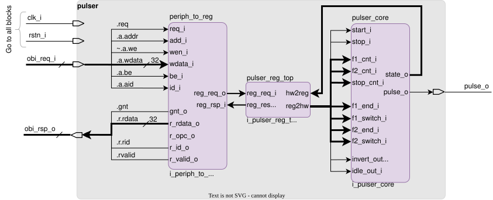
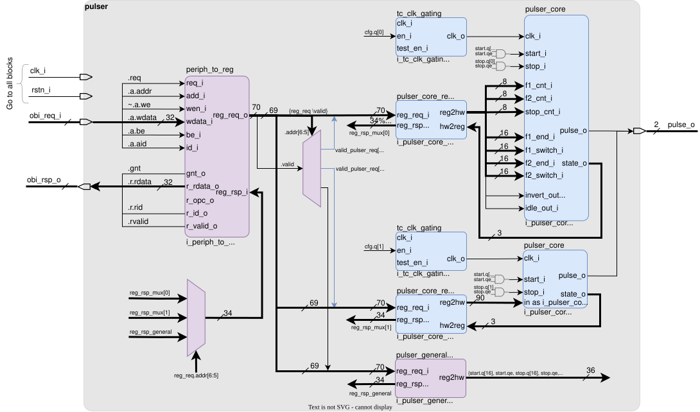

# Pulser
[](LICENSE)

**Pulser** is a SystemVerilog-based hardware project for generating precisely timed output pulses with configurable parameters. It includes a complete RTL implementation, simulation environment, and auto-generated register files. Each pulser instance is configurable and controllable via the Open Bus Interface (OBI).

## Features

- Parameterizable pulse generator
- Register-mapped configuration interface
- Fully configurable pulse characteristics
- Software-controllable start/stop mechanisms
- Simulation testbench for `pulser_core`
- Auto-generated register definitions from HJSON

## Overview

The design is centered around two main modules:

- **`pulser`** – The top-level module that integrates the core pulse generation logic and register files. It provides the primary system interface, managing control signals and coordinating `pulser_core` instances.
- **`pulser_core`** – Handles the critical timing and control logic for pulse generation. This module is designed for precision and low-latency operation.

## Block Diagram

Pulser is architected with a layered approach, separating register access from pulse logic. The diagrams below illustrate both a simplified conceptual model and the complete system.

### Simplified Architecture

The following diagram shows a conceptual single-`pulser_core` setup with its register interface. This structure is for illustrative purposes only and is **not** implemented.



- **`periph_to_reg`**: Converts OBI to internal register requests/responses.
- **`pulser_reg_top`**: Holds configuration and control (start/stop) registers.
- **`pulser_core`**: Executes the pulse generation logic.

### Full System Architecture

The implemented system supports multiple `pulser_core` instances, each with its own dedicated register file. A multiplexer/demultiplexer is used to route register access requests and responses to the correct instance. The diagram below shows an example with `N_PULSER_INST = 2`. Replicated components are highlighted in blue.



- **`periph_to_reg`**: OBI-to-register bridge
- **`pulser_core_reg_top`**: Per-instance configuration registers
- **`pulser_general_reg_top`**: Shared start/stop control
- **`pulser_core`**: Independent pulse generation logic

## Register Generation

Register files are generated from HJSON descriptions using a dedicated register tool.

### Generate Register Files

SystemVerilog files:
```bash
regtool.py -r -t rtl/ data/pulser_core.hjson
regtool.py -r -t rtl/ data/pulser_general.hjson
```

C header files:
```bash
regtool.py -D data/pulser_core.hjson -o sw/pulser_core_reg_defs.h
regtool.py -D data/pulser_general.hjson -o sw/pulser_general_reg_defs.h
```

## License

The Pulser project is licensed under the Solderpad Hardware License v0.51 (SHL-0.51). See the [`LICENSE`](LICENSE) file for details.
