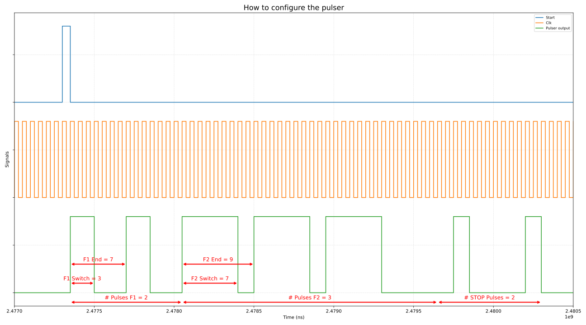
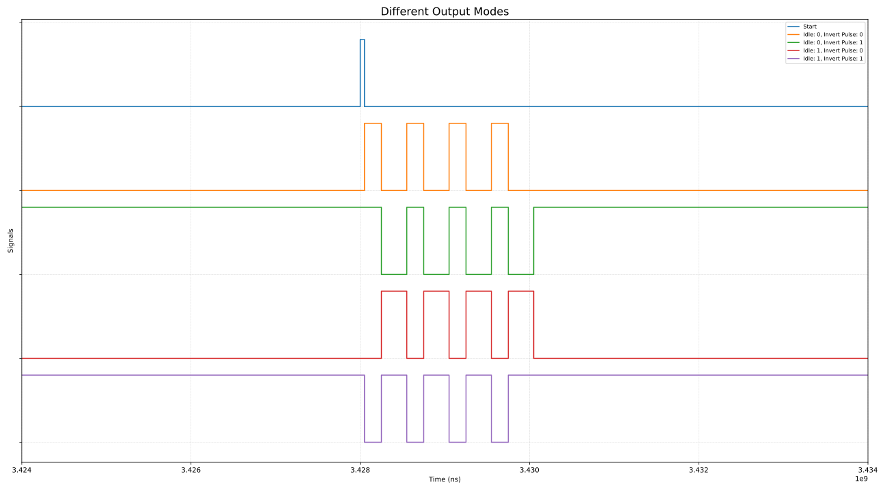
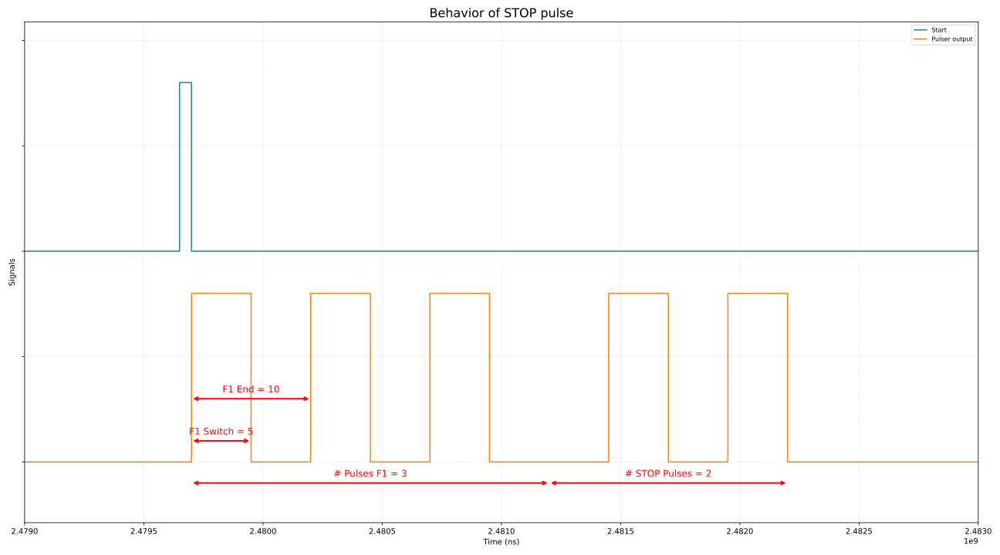
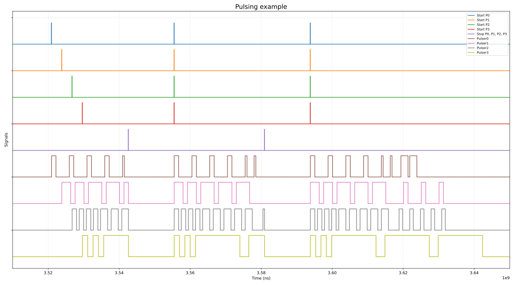

# Pulser Configuration Guide

This guide explains how to configure and operate the module `pulser` via register interface. It assumes you have already generated and instantiated the register files as described in the main README.

## Table of Contents

- [Parameters](#parameters)
- [Output Modes](#output-modes)
- [Stop Pulse Behavior](#stop-pulse-behavior)
- [Operation](#operation)
- [Register Overview](#register-overview)
- [Code Examples](#code-examples)

---

## Parameters

Each pulser provides several parameters to control its pulsing behavior:

| Parameter   | Description                                         |
|-------------|-----------------------------------------------------|
| **F1 End**      | Sets the period for frequency F1 (lower value = higher frequency) |
| **F1 Switch**   | Sets the duty cycle for F1 (switching point within the F1 period) |
| **F2 End**      | Sets the period for frequency F2                |
| **F2 Switch**   | Sets the duty cycle for F2 (switching point within the F2 period) |
| **F1 Count**    | Number of cycles for the first pulse (F1)       |
| **F2 Count**    | Number of cycles for the second pulse (F2)      |
| **STOP Count**  | Number of stop pulse cycles                     |

> **Note:**  
> - **F1** and **F2** are two independent frequencies.  
> - The `End` parameter sets the period (inverse of frequency), while the `Switch` parameter sets the duty cycle for each frequency.

The diagram below illustrates how these parameters affect the pulser output:


*Figure: Pulser parameter effects (F1 & F2 duration/switch control).*

---

## Output Modes

The pulser output can be further configured:

- **Inverted Output**  
  - When set to `1`, the output pulses are active-low instead of active-high during pulsing phases.  
  - Example: If a normal F1 pulse would go from `0→1` at the switch point, an inverted output goes `1→0`.

- **Idle Level**  
  - Defines the steady value on the output pin when no pulse sequence is running.  
  - `0` = output held low (classic behavior);  
    `1` = output held high (useful if you want a negative-going pulse or delay a sequence but start at same time as other pulsers).

Below is an example of each output configuration combination.  

*Figure: Idle Level and Invert Output configurations.*

---

## Stop Pulse Behavior

When the F1 (and possibly F2) pulses are done, the output generates a "stop pulse". The behavior of this stop pulse depends on which frequency was active last:

- **If the last pulse was at frequency F2:**  
  The stop pulse will be an inverted F2 pulse.

- **Otherwise (if F2 was not active):**  
  The stop pulse will be an inverted F1 pulse.

This helps dampen oscillations created by the F1/F2 pulses.


*Figure: Show stop pulse behavior.*

---

## Operation

1. **Enable the Clock**  
   Each pulser instance’s clock must be enabled via the general configuration register. Assuming `GENERAL_BASE` is the base address of the `pulser_general` register block, to enable instance `i` (0-based).

2. **Configure F1 & F2**  
   Use the core configuration registers to set the F1/F2 end and switch values. Let `CORE_i_BASE` be the base address of pulser core instance `i`.  

3. **Set Pulse Counts**  
   Specify how many cycles to output in each phase (F1, F2) and how many stop pulses. Write to the CNT register.

4. **Set Idle Level & Invert Output (Optional)**  
   Control the idle output and inversion via the CTRL_OUT register.

5. **Start the Pulser**  
   To begin the pulse sequence for instance `i`, write to the general control register.

6. **Poll for Completion (Optional)**  
   To know, when the pulser finished, read the core status register and check the READY bit.

7. **Stopping Mid-Sequence (Optional)**  
   To request an immediate stop for instance `i`, write to the STOP field in the general control register.

8. **Multiple Instances**  
   You can control multiple cores independently or synchronized, as shown below.


*Figure: Start four pulsers individual, stop all, start and stop them at the same time.*

---

## Register Overview

### Reg Core

| **Offset** | **Register Name**  | **Fields**                       | **Bit Widths** |
|------------|--------------------|----------------------------------|----------------|
| **0x00**   | F1_CFG             | f1_end, f1_switch                | 16, 16         |
| **0x04**   | F2_CFG             | f2_end, f2_switch                | 16, 16         |
| **0x08**   | COUNT_CFG          | stop_count, f2_count, f1_count   | 8, 8, 8        |
| **0x0C**   | STATUS             | state, ready                     | 3, 1           |
| **0x10**   | OUT_CTRL           | idle_out, invert_out             | 1, 1           |

### Reg General

The general register starts at `PULSER_OFFSET_PER_ID * N_PULSERS`, which for this design is 0x20 * 4 = 0x80

| **Offset** | **Register Name**        | **Fields**    | **Bit Widths** |
|------------|--------------------------|---------------|----------------|
| **0x00**   | PULSER_GENERAL_CTRL      | start, stop   | 16, 16         |
| **0x04**   | PULSER_GENERAL_CFG       | enable        | 16             |

---

## Code Examples

### Write

 ```c
 // Low-level register access helpers
 static inline void pulser_write(pulser_id_t id, int reg_offset, int value)
{
  *reg32(PULSER_BASE_ADDR , reg_offset + id * PULSER_OFFSET_PER_ID) = value;
}

void pulser_config_out(pulser_id_t id, int invert_out, int idle_high) {
  int reg = 0;
  if (invert_out)
  {
      reg |= (1 << PULSER_CORE_CTRL_OUT_INVERT_OUT_BIT);
  }
  if (idle_high)
  {
      reg |= (1 << PULSER_CORE_CTRL_OUT_IDLE_OUT_BIT);
  }
  pulser_write(id, PULSER_CORE_CTRL_OUT_REG_OFFSET, reg);
}
 ```

### Read

```c
static inline int pulser_read(pulser_id_t id, int reg_offset)
{
    return *reg32(PULSER_BASE_ADDR, reg_offset + id * PULSER_OFFSET_PER_ID);
}

int pulser_ready(pulser_id_t id)
{
    int reg = pulser_read(id, PULSER_CORE_STATUS_REG_OFFSET);
    return (reg & (1 << PULSER_CORE_STATUS_READY_BIT)) >> PULSER_CORE_STATUS_READY_BIT;
}
```

### Enable Pulser

```c
// to enable pulser2, write 0b100
void pulser_en(int pulser_to_en)
{
    uint32_t offset_pulsers = PULSER_OFFSET_PER_ID * N_PULSERS; // Start addr of general register
    volatile uint32_t *cfg_reg = (volatile uint32_t *)(PULSER_BASE_ADDR + offset_pulsers + PULSER_GENERAL_CFG_REG_OFFSET);

    uint32_t regval = *cfg_reg;
    *cfg_reg = regval | (pulser_to_en << PULSER_GENERAL_CFG_EN_OFFSET);
}
```


### Use `PULSER_CORE_X_FIELD` from `pulser_core_reg_defs.h`

```c
uint32_t bitfield_set_field32(bitfield_field32_t field, uint32_t reg, uint32_t value)
{
    reg &= ~(field.mask << field.index);
    reg |= ((value & field.mask) << field.index);
    return reg;
}

// Set phase F1 end and switch values
void pulser_set_f1_end_switch(pulser_id_t id, int endvalue, int switchvalue)
{
    int reg = 0;
    reg = bitfield_set_field32(PULSER_CORE_CFG_F1_SWITCHVAL_FIELD, reg, (uint32_t)switchvalue);
    reg = bitfield_set_field32(PULSER_CORE_CFG_F1_ENDVAL_FIELD, reg, (uint32_t)endvalue);
    pulser_write(id, PULSER_CORE_CFG_F1_REG_OFFSET, reg);
}
```
